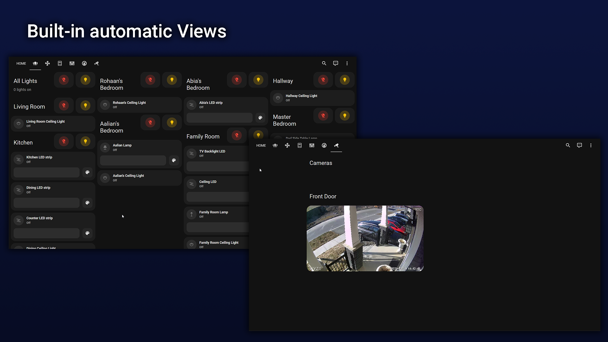
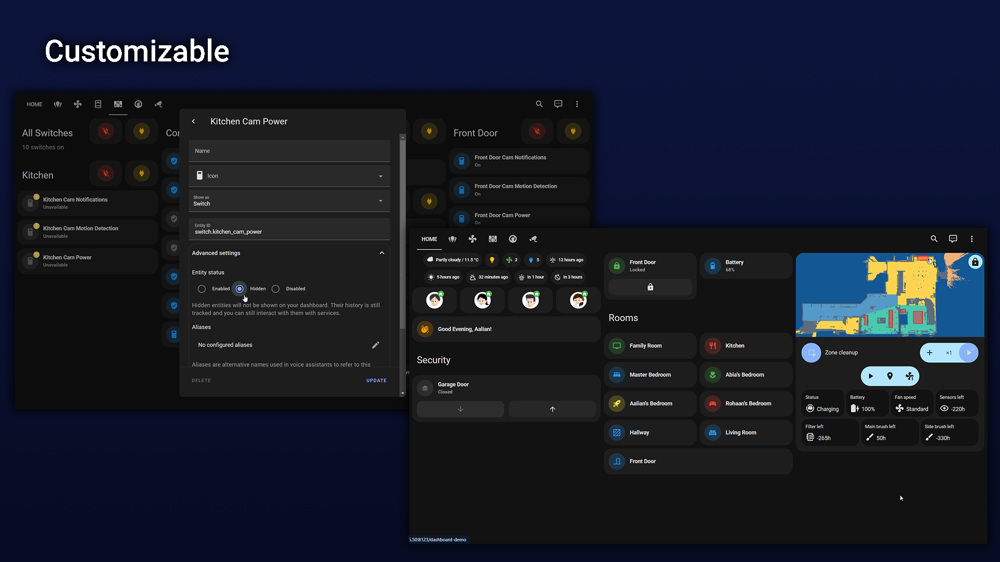

# Mushroom dashboard strategy

[![hacs][hacs-badge]][hacs-url]
[![release][release-badge]][release-url]






## What is Mushroom dashboard strategy ?

Mushroom dashboard strategy provides a strategy for Home assistant to automatically create a dashboard using Mushroom cards, the area configuration and entity configuration.

My goal is to propose a way to create powerful dashaboards without the need of spending hours manualy creating them.

### Features

-   🛠 Automatically create dashboard with 3 lines of yaml
-   😍 Built-in Views for device specific controls
-   🎨 Many options to customize to your needs

## Installation

### HACS

Mushroom dashboard strategy is available in [HACS][hacs] (Home Assistant Community Store).

1. Install HACS if you don't have it already
2. Open HACS in Home Assistant
3. Go to "Frontend" section
4. Click button with "+" icon
5. Search for "Mushroom strategy"

### Manual

1. Download `mushroom-strategy.js` file from the [latest-release].
2. Put `mushroom-strategy.js` file into your `config/www` folder.
3. Add reference to `mushroom-strategy.js` in Dashboard. There's two way to do that:
    - **Using UI:** _Settings_ → _Dashboards_ → _More Options icon_ → _Resources_ → _Add Resource_ → Set _Url_ as `/local/mushroom-strategy.js` → Set _Resource type_ as `JavaScript Module`.
      **Note:** If you do not see the Resources menu, you will need to enable _Advanced Mode_ in your _User Profile_
    - **Using YAML:** Add following code to `lovelace` section.
        ```yaml
        resources:
            - url: /local/mushroom-strategy.js
              type: module
        ```
## Preresquisites

You need to install these cards first before using this strategy
- [Mushroom cards][mushroom]
- [Mini graph card][mini-graph]
- [Web RTC][webrtc]

## Usage

All the Rounded cards can be configured using Dashboard UI editor.

1. In Dashboard UI, click 3 dots in top right corner.
2. Click _Edit Dashboard_.
3. Click 3 dots again
4. Click `Raw configuration editor`
5. Add these lines
```yaml
strategy:
  type: custom:mushroom-strategy
views: []
```

## Strategy options

| Name                 | Type                   | Default                 | Description                                                    | 
|:---------------------|:-----------------------|:------------------------|:---------------------------------------------------------------|
| `areas`              | list                   | Optional                | One or more areas in a list, see areas object                  |
| `entity_config`      | list                   | Optional                | Custom card defination for an entity, see entity_config object |
| `views`              | object                 | All views enabled       | Setting which pre-built views to show, see available views     |
| `chips`              | object                 | All count chips enabled | Setting which pre-built chips to show, see available chips     |
| `quick_access_cards` | list of cards          | Optional                | List of cards to show below welcome card and above rooms cards |
| `extra_cards`        | list of cards          | Optional                | List of cards to show below room cards                         |
| `extra_chips`        | list of mushroom chips | Optional                | List of chips to show on home view                             |

### Area object
The area object includes all options from the template mushroom card and `extra_cards` which is a list of cards to show at the top of the area subview

| Name                  | Type            | Default     | Description                                                                                                                         |
| :-------------------- | :-------------- | :---------- | :---------------------------------------------------------------------------------------------------------------------------------- |
| `icon`                | string          | Optional    | Icon to render. May contain [templates](https://www.home-assistant.io/docs/configuration/templating/).                              |
| `icon_color`          | string          | Optional    | Icon color to render. May contain [templates](https://www.home-assistant.io/docs/configuration/templating/).                        |
| `primary`             | string          | Optional    | Primary info to render. May contain [templates](https://www.home-assistant.io/docs/configuration/templating/).                      |
| `secondary`           | string          | Optional    | Secondary info to render. May contain [templates](https://www.home-assistant.io/docs/configuration/templating/).                    |
| `badge_icon`          | string          | Optional    | Badge icon to render. May contain [templates](https://www.home-assistant.io/docs/configuration/templating/).                        |
| `badge_color`         | string          | Optional    | Badge icon color to render. May contain [templates](https://www.home-assistant.io/docs/configuration/templating/).                  |
| `picture`             | string          | Optional    | Picture to render. May contain [templates](https://www.home-assistant.io/docs/configuration/templating/).                           |
| `multiline_secondary` | boolean         | `false`     | Enables support for multiline text for the secondary info.                                                                          |
| `layout`              | string          | Optional    | Layout of the card. Vertical, horizontal and default layout are supported                                                           |
| `fill_container`      | boolean         | `false`     | Fill container or not. Useful when card is in a grid, vertical or horizontal layout                                                 |
| `tap_action`          | action          | `none`      | Home assistant action to perform on tap                                                                                             |
| `hold_action`         | action          | `none`      | Home assistant action to perform on hold                                                                                            |
| `entity_id`           | `string` `list` | Optional    | Only reacts to the state changes of these entities. This can be used if the automatic analysis fails to find all relevant entities. |
| `double_tap_action`   | action          | `more-info` | Home assistant action to perform on double_tap                                                                                      |
| `extra_cards`         | list of cards   | Optional    | A list of cards to show on the top of the area subview                                                                              |

#### Example
```yaml
areas:
  - name: Family Room
    icon: mdi:television
    icon_color: green
    extra_cards:
      - type: custom:mushroom-chips-card
        chips:
          - type: entity
            entity: sensor.family_room_temperature
            icon: mdi:thermometer
            icon_color: pink
        alignment: center
  - name: Kitchen
    icon: mdi:silverware-fork-knife
    icon_color: red
```


## Credits

* The cards used are from [Mushroom][mushroom], [Mini graph card][mini-graph] and [Web RTC][webrtc]
* Took inspiration from [Balloob battery strategy][balloobBattery]

<!-- Badges -->

[hacs-url]: https://github.com/hacs/integration
[hacs-badge]: https://img.shields.io/badge/hacs-default-orange.svg?style=flat-square
[release-badge]: https://img.shields.io/github/v/release/lovelace-rounded/ui?style=flat-square
[downloads-badge]: https://img.shields.io/github/downloads/lovelace-rounded/ui/total?style=flat-square
[build-badge]: https://img.shields.io/github/actions/workflow/status/lovelace-rounded/ui/build.yml?branch=main&style=flat-square

<!-- References -->

[home-assistant]: https://www.home-assistant.io/
[home-assitant-theme-docs]: https://www.home-assistant.io/integrations/frontend/#defining-themes
[hacs]: https://hacs.xyz
[mushroom]: https://github.com/piitaya/lovelace-mushroom
[mini-graph]: https://github.com/kalkih/mini-graph-card
[webrtc]: https://github.com/AlexxIT/WebRTC
[balloobBattery]: https://gist.github.com/balloob/4a70c83287ddba4e9085cb578ffb161f
[release-url]: https://github.com/AalianKhan/mushroom-strategy/releases
